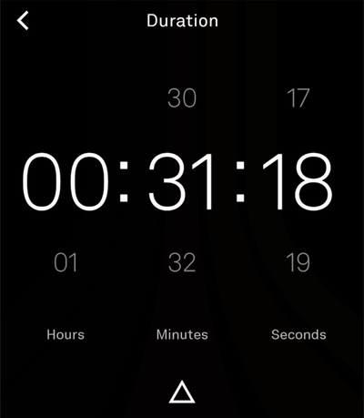

# light-training
a tool for tracking lifting and cardio workouts built with the light-sdk for the lightOS

## Screenshots

| | | |
|---|---|---|
|  |  |  |

## Roadmap

- Cardio workout tracking
  - [x] exercise type
  - [x] duration
  - [x] distance
  - [x] pace (calculated from duration + distance)
  - Interval training (work/rest scheme, rounds) — built, hidden behind a "coming soon" flag until it's ready to ship
- Weight training
  - RPE?
  - View previous reps/sets/weights of an exercise
  - Use previous workout as a template for a new workout
- Trends / Analytics
  - Sets per time period
    - per muscle group
    - per exercise
  - Distance/time per time period
- Data backup
