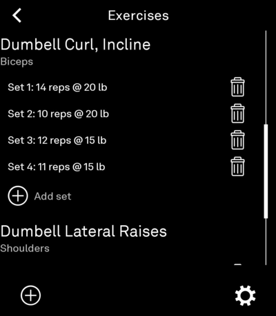
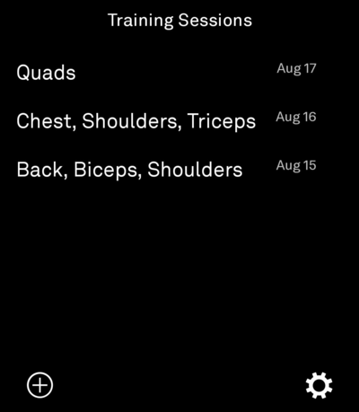

# light-training
a tool for tracking lifting and cardio workouts built with the light-sdk for the lightOS

## Screenshots

| | |
|---|---|
|  |  |

## Roadmap

- Cardio workout tracking
  - exercise type
  - pace
  - duration
  - distance
  - support for interval training
    - rest/work scheme
    - rest periods
    - number of rounds?
  - tbd
- Trends
  - Sets per time period
    - per muscle group
    - per exercise
  - Distance/time per time period
