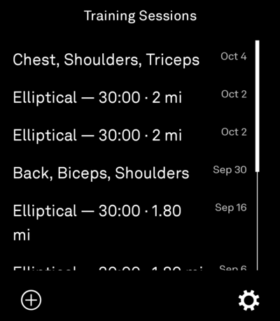
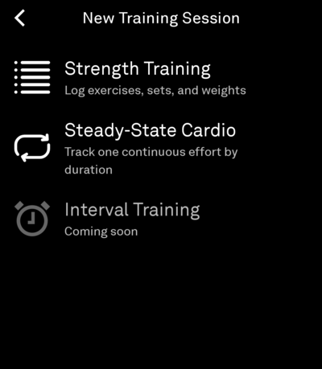
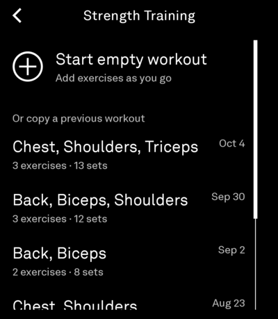
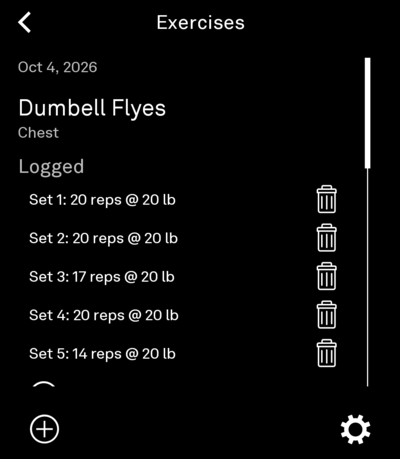
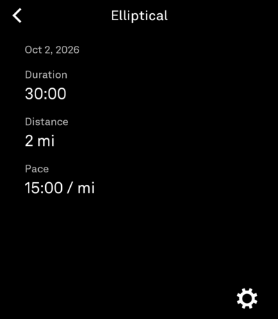
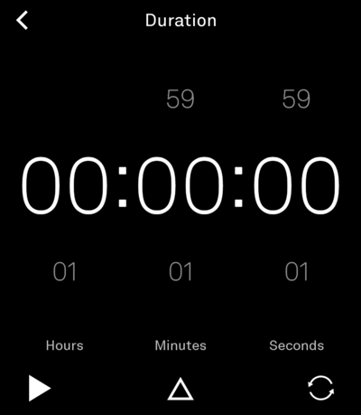

# light-training
a tool for tracking lifting and cardio workouts built with the light-sdk for the lightOS

## Screenshots

| | | |
|---|---|---|
|  |  |  |
|  |  |  |

## Roadmap

- Cardio workout tracking
  - [x] exercise type
  - [x] duration
  - [x] distance
  - [x] pace (calculated from duration + distance)
  - Interval training (work/rest scheme, rounds) — built, hidden behind a "coming soon" flag until it's ready to ship
- Weight training
  - RPE?
  - View previous reps/sets/weights of an exercise
  - [x] Use previous workout as a template for a new workout
- Trends / Analytics
  - Sets per time period
    - per muscle group
    - per exercise
  - Distance/time per time period
- Data backup — in progress (per-session JSON exports, backed up through Tool Manager)

## Building and releasing

The tool lives in `tool/`; `sdk/` is vendored from [light-sdk](https://github.com/lightphone/light-sdk) and is never edited here.

```bash
./gradlew :tool:assembleDebug        # signed debug APK
./gradlew :tool:testDebugUnitTest    # JVM unit tests
```

Releases are built by Light, via **Submit Build** on the developer dashboard, from a commit SHA. Their builder copies only `tool/lighttool.toml`, `tool/build.gradle.kts` and `tool/src/main/{kotlin,java,res,assets}`, and compiles them against its own copy of the SDK. So:

- `sdkVersion` in `gradle.properties` must be a released light-sdk tag. Sync `sdk/` to that tag with a merge commit, not a squash.
- `tool/` must build against an unmodified `sdk/`. Anything it needs that the SDK doesn't expose belongs in `tool/`.
- Bump `versionCode` and `versionName` in `tool/lighttool.toml` for every submission.
- Database schema changes use Room auto-migrations. The SDK's `buildDatabase()` can't take hand-written migrations ([light-sdk#227](https://github.com/lightphone/light-sdk/issues/227)), and the schema snapshots live in `tool/src/main/assets/schemas/` so the builder can read them. See the note on `TrainingDatabase`.

To check a release build locally the way the builder runs it:

```bash
./gradlew -DlightSdk.toolOnly=true -DlightSdk.unsigned=true :tool:assembleRelease
```
